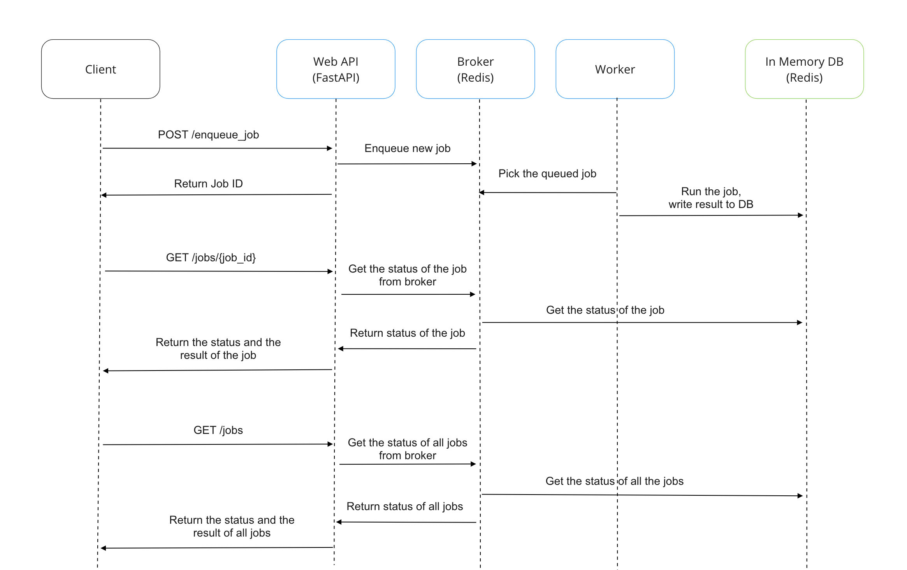
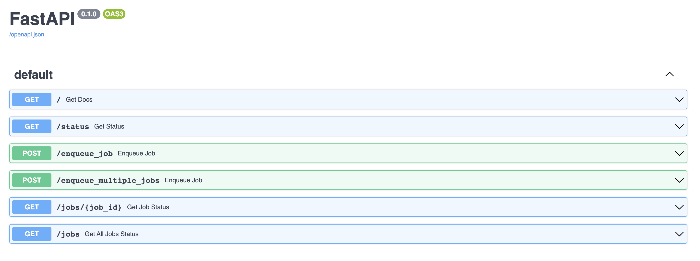

# Functional requirements
Web API that supports the following operations:
- The client can enqueue a new job, by providing an unsorted array of numbers as input
- The client can retrieve an overview of all jobs (both pending and completed)
- The client can retrieve a specific job by its ID, including the output (sorted array) if the job has completed  

A job takes an unsorted array of numbers as input, sorts the input using an algorithm of your choice, and outputs the sorted array.  

Apart from the input and output arrays a job should include the following metadata:
- An ID - a unique ID assigned by the application A timestamp - when was the job enqueued?
- A duration - how much time did it take to execute the job? A status - for example "pending" or "completed", etc.  
All jobs should be processed in the background and clients should not be forced to wait for jobs to complete.
To view the output of a job (the sorted array), the client must query a previously enqueued job.

# System Overview
Here is the sequence diagram and the overview of the this software's main components.


## Web API (Fast API)
Fast API based web application. It allows the users to 
1. Enqueue the job with list of unsorted integer array
2. Fetches the specific job status by job ID
3. Get the list of all the jobs (incl finished, failed and queued)

## In memory database (Redis)
In-memory database to store the enqueued jobs, their status and work as message broker at the same time.
It enqueue the jobs and distribute them to the workers. It also allows us to keep the ID of the jobs such that we can retrieve the metadata anytime.
In order to avoid crushing the memory, the limit for storing the finished jobs are set to 500 seconds.

## Broker (Redis)
RQ based message queue broker. It is backed by Redis running either local or remote.
Broker takes the requested jobs from the clients and place them in the queue.

## Worker
Once there is a job in the message queue, the Redis broker distribute the job to the workers.
Worker takes the input array from the queue, run the sorting function and return the sorted array to Redis associated with metadata such as job ID, execution time and so on.

# Folder Structure
```
├── .gitignore
├── README.md
├── assets
├── Dockerfile
├── docker-compose.yml
├── setup.cfg
├── setup.py
└── src
    ├── main.py
    ├── endpoionts
    │   ├── docs.py
    │   ├── status.py
    │   └── job.py
    ├── executor
    │   ├── __init__.py
    │   ├── message_queue.py
    │   └── worker.py
    ├── utils
    │   ├── common_logger.py
    │   ├── types.py
    │   └── custom_error_handlers.py
    └── tests
        ├── endpoints
        │   ├── test_docs.py   
        │   ├── test_job.py   
        │   └── test_status.py
        └── executor
            ├── test_worker.py   
            └── test_message_queue.py
```

# How to launch the application
## with Docker (recommended)
```
docker-compose build && docker-compose up -d
```

## without Docker
### 1. Create virtual environment (required Python >=3.8)
`python -m virtualenv venv`  
`source venv/bin/activate`

### 2. Install dependencies
`pip install .[all]`

### 3. Launch Redis
`redis-server`

### 4. Launch Web API
`python src/main.py`

### 5. Launch Worker
`python src/executor/worker.py`

Once the application is launched, you should be able to see the Swagger documentation of Web API at `localhost:5000`



# How to test
After launching the application followed by the guide above, you can query APIs.
### Enqueue a job
```
curl -X 'POST' \
  'http://0.0.0.0:5555/enqueue_job' \
  -H 'accept: application/json' \
  -H 'Content-Type: application/json' \
  -d '{
  "array": [
    0,1,3,4
  ]
}'
```

### Get a job status by ID
```
curl -X 'GET' \
  'http://0.0.0.0:5555/jobs/e5bcb6c2-692c-44a5-b1a1-d714c2c6ad7a' \
  -H 'accept: application/json'
```

### Get all jobs and their status
```
curl -X 'GET' 'http://0.0.0.0:5000/jobs' -H 'accept: application/json'
```